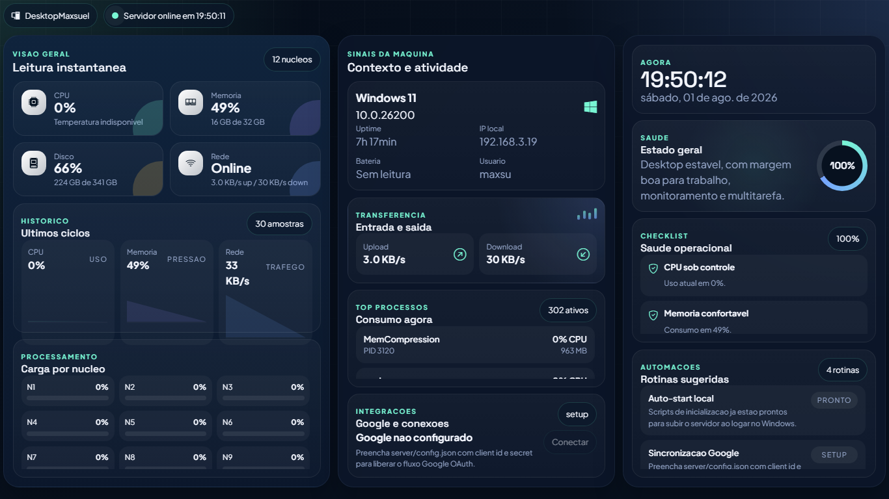
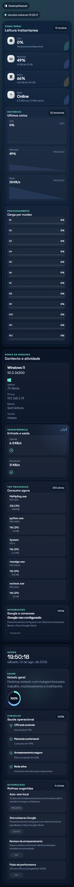

# Monitor CPU

## Descricao

Dashboard local para acompanhar recursos do sistema, com frontend HTML/CSS/JS e servidor Python responsavel pelas leituras e integracoes opcionais.

## Demonstracao Visual

| Desktop | Mobile |
| --- | --- |
|  |  |

## Funcionalidades

- Leitura local de metricas de sistema
- Dashboard responsivo com Bootstrap Icons
- Servidor Python leve
- Config de OAuth Google opcional por arquivo local ou variaveis de ambiente
- Scripts auxiliares para Windows

## Tecnologias

- HTML5
- CSS3
- JavaScript
- Python
- HTTP server local

## Estrutura

- `.gitignore`
- `README.md`
- `assets/`
- `docs/`
- `index.html`
- `readme`
- `register-monitor-hub-task.ps1`
- `server/`
- `start-monitor-hub.bat`

## Requisitos

- Python 3
- Navegador moderno
- Permissao local para ler metricas do sistema

## Instalacao

- python -m venv .venv
- .venv\Scripts\pip install -r server\requirements.txt

## Variaveis de Ambiente

- GOOGLE_CLIENT_ID: opcional, usado no fluxo OAuth local
- GOOGLE_CLIENT_SECRET: opcional, usado no fluxo OAuth local
- GOOGLE_REDIRECT_URI: opcional, padrao local definido pelo servidor

## Comandos Disponiveis

| Acao | Comando |
| --- | --- |
| Executar | `python server/app.py` |
| Windows helper | `start-monitor-hub.bat` |

## Execucao

Acesse a URL local exibida pelo servidor, normalmente http://127.0.0.1:8765/.

## Build

Nao possui etapa de build.

## Observacoes

- Nao publique server/config.json, server/runtime/*, tokens OAuth ou arquivos gerados localmente.
- O arquivo server/config.example.json contem apenas placeholders.

## Autor

Maxsuel Oliveira

## Licenca

Este projeto esta licenciado sob a licenca MIT.
